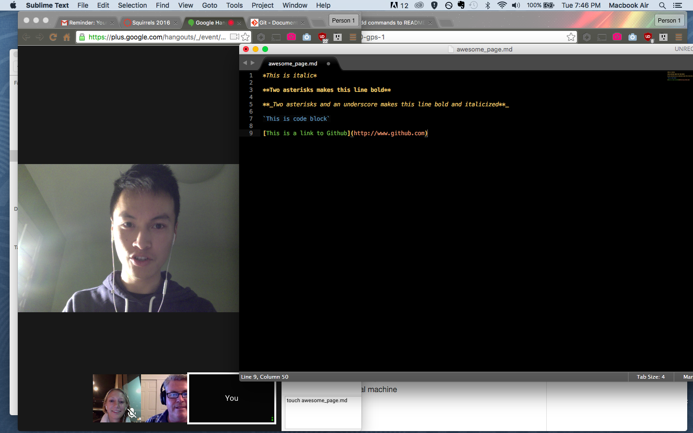

*This is italic*

**Two asterisks makes this line bold**

**_Two asterisks and an underscore makes this line bold and italicized**_

`This is code block`

[This is a link to Github](http://www.github.com)

	This is a different message to create a conflict